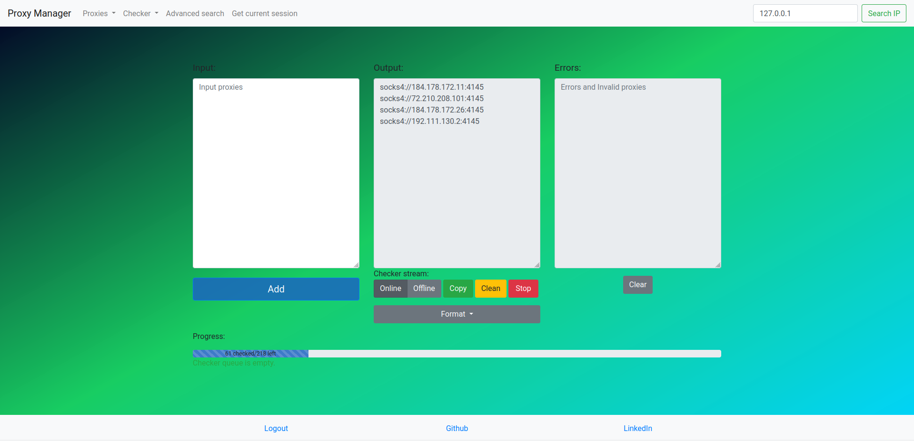

<p style="text-align: center;">Simple tool to manage your proxies</p>



# Proxy Manager
#### Made with FastAPI, PostgreSQL, Redis and Celery

## What it does?
- Checks and stores your proxies
- Provides easy API
- Can be used as local proxy store, but for free
- Can be easily integrated in your script

## Why I should use it instead of other checkers, databases, payable stores...
Well, this tool is all-in-one and absolutely for free.

## How to run it
### Via Docker locally
1. Install [Docker](https://www.docker.com/)
2. `git clone https://github.com/nightisstillyoung/Proxy-Manager.git`
3. `cd Proxy-Manager`
   1. (Optional) `.env-deploy`
      - `TASKS=10` sets how many celery workers will handle your proxies 
      - `DB_*` Postgres Database settings
   2. (Optional) Configure auth
      - `AUTH=1` Delete this env if you want to disable authentication.
      - `EXPIRES=12` expires after 12 hours
   3. (Optional) How to configure Redis, Checker and CORS see below
4. Generate private and public keys: `sh keygen.sh` or
   ```shell
   cd src
   
   # from src
   KEYDIR='src/auth_jwt/keys/'
   
   # make dir if not exists
   mkdir ${KEYDIR} || true
   
   # generate an RSA private key
   openssl genrsa -out ${KEYDIR}jwt-private.pem 2048
   
   # generate an RSA public key
   openssl rsa -in ${KEYDIR}jwt-private.pem -outform PEM -pubout -out ${KEYDIR}jwt-public.pem
   
   ```
5. Run `mv .env-deploy .env`
6. Run `docker compose up`
7. [Open in browser http://localhost:9000](http://localhost:9000)

### Without docker on your own
1. `cd Proxy-Manager`
2. Install PostgreSQL  and Redis
3. Configure `.env-deploy`. Settings are the same as in the first example. But, 
    you have to change HOST settings:
    - `DB_HOST=localhost` if you are running database on the same server
    - `REDIS_HOST=localhost` Same as database
    - (Optional) change `*_PORT=` settings
4. Create virtual environment `python3 -m venv venv`
5. `source venv/bin/activate`
6. Install dependencies `pip install -r requirements.txt`
7. Generate private and public keys for JWT tokens `sh keygen.sh`
8. `cd src` and
   1. Start celery: `celery --app=tasks.tasks:broker worker -l INFO -c 10` where
       `-c 10` means 10 workers
   2. (Optional) Start flower: `celery --app=tasks.tasks:broker flower` [Flower](http://localhost:5555)
   3. Start App: `gunicorn main:app --workers 4 --worker-class uvicorn.workers.UvicornWorker --bind=0.0.0.0:9000`

9. [Open in browser http://localhost:9000](http://localhost:9000) 

### On windows
1. [Install WSL](https://learn.microsoft.com/en-us/windows/wsl/install)
2. Choose one of the methods above

## How to use it via API?
### With auth
First, **IF** you use authentication you must open Proxy Manager in your browser, log in, 
and push Get API token button on the navigation bar. To access it via curl, for example, you must add `X-Api-Token` header Example:
```commandline
$ curl -X 'GET' \
  'http://localhost:9000/proxies/progress' \
  -H 'accept: application/json' \
  -H 'X-Api-Token: eyJhbGci....'

{"status":0,"data":{"progress":{"current_len":0,"initial_len":53,"progressbar_width":100.0,"value_now":53}}}
```
By using requests:
```python
import requests

url = 'http://localhost:9000/proxies/progress'

headers = {
    'accept': 'application/json',
    'X-Api-Token': 'eyJhbGci....'
}

response = requests.get(url, headers=headers)

print(response.json())


>>> {"status":0,"data":{"progress":{"current_len":0,"initial_len":53,"progressbar_width":100.0,"value_now":53}}}
```

### Without auth
Same, but without any tokens:
```commandline
$ curl -X 'GET' \
  'http://localhost:9000/proxies/progress' \
  -H 'accept: application/json'

{"status":0,"data":{"progress":{"current_len":0,"initial_len":53,"progressbar_width":100.0,"value_now":53}}}
```


## Additional configuration
All config files, except .env, are stored in src/configs/*.yaml

### checker.yaml
- `timeout` seconds before unanswered request will be cancelled
- `retries` checked will retry to connect proxy several times, by default `retries` is set to 2

### redis.yaml
All written settings are applied to all redis connections. 
```Python
def get_async_conn() -> AsyncRedis:
    return AsyncRedis(**redis_config)


def get_conn() -> Redis:
    return Redis(**redis_config)
```

### website.yaml
Here you can configure CORS:
```yaml
cors_origins:
  - http://localhost
  - http://example.com
```

### jwt.yaml
```yaml
keys:
  # src/auth_jwt/keys/...
  private-key: jwt-private.pem
  public-key: jwt-public.pem
algorithm: RS256
expire_hours: !!int 12
```

## Where I can find endpoint documentation?
FastAPI provides autogenerated documentation in /docs path, so open <http://localhost:9000/docs>

## TODO
- [ ] Geodata
- [ ] Periodic re-check of all proxies in database
- [ ] GraphQL
- [ ] Replace Celery with [taskiq](https://taskiq-python.github.io/) or Kafka
- [ ] Make frontend as single-page-application
- [ ] Refactor proxy_processing router (file too long)